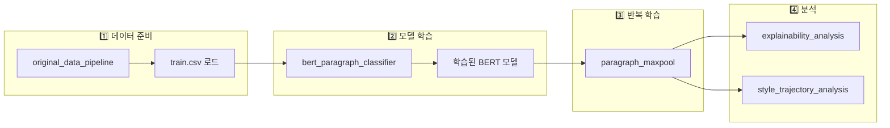
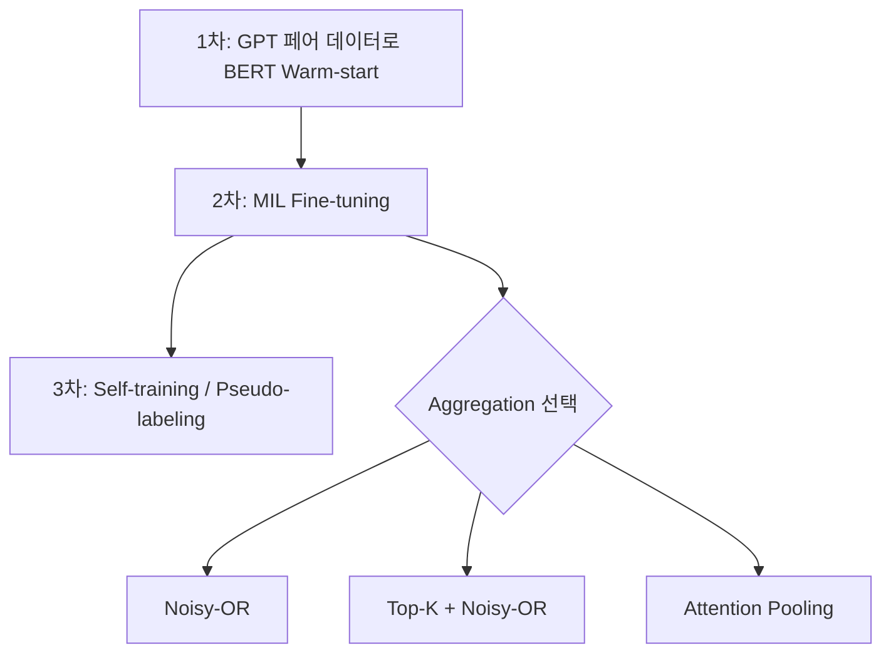

# 🚀 Colab Notebooks Guide

AI/Human 텍스트 분류 프로젝트의 전체 파이프라인을 Google Colab에서 실행할 수 있는 노트북 모음입니다.

---

## 📊 파이프라인 개요



---

## 📁 노트북 목록 & 실행 순서

| 순서 | 파일명                                    | 설명                                                 | 입력                        | 출력                            |
| :---: | ----------------------------------------- | ---------------------------------------------------- | --------------------------- | ------------------------------- |
| 1️⃣ | `original_data_pipeline_colab.ipynb`    | 데이터 로드 & 전처리                                 | `train.csv`, `test.csv` | 전처리된 DataFrame              |
| 2️⃣ | `bert_paragraph_classifier_colab.ipynb` | BERT 분류기 학습                                     | 전처리된 데이터             | `best_model.pt`               |
| 3️⃣ | `paragraph_maxpool_colab.ipynb`         | MIL 기반 반복 학습 (**Aggregation 선택 가능**) | `best_model.pt`           | 개선된 모델,`submission.csv`  |
| 4️⃣ | `explainability_analysis_colab.ipynb`   | SHAP/LIME 설명가능성 분석                            | 학습된 모델                 | Attention 시각화, Rationale     |
| 5️⃣ | `style_trajectory_analysis_colab.ipynb` | 스타일 궤적 분석 (Okt)                               | 문서 텍스트                 | 형태소 분석, 스타일 변화 그래프 |

> **📌 Note**: `paragraph_maxpool_colab.ipynb`에서 `AGGREGATION` 파라미터로 `'max'` 또는 `'avg'` 선택 가능

---

## 🧠 이론적 배경: Multiple Instance Learning (MIL)

### 문제 정의

> **Document label only + Long input + Paragraph label missing**

본 프로젝트는 전형적인 **MIL (Multiple Instance Learning)** 문제입니다:

```
📄 문서 (Bag) = [문단1, 문단2, ..., 문단N] (Instances)
                         ↓
              문서 라벨만 존재 (0=Human, 1=AI)
              문단 라벨은 존재하지 않음 (Latent)
```

### 데이터 관점의 비대칭성

| 문서 타입             | Bag 성격            | Instance 가정                          |
| --------------------- | ------------------- | -------------------------------------- |
| **Human (y=0)** | Strong Negative Bag | 모든 문단이 Human일 확률 높음          |
| **AI (y=1)**    | Positive Bag        | 최소 1개 이상 문단이 AI (또는 mixture) |

### 모델 아키텍처

```
┌─────────────────────────────────────────────────────────┐
│  문단 p_i → BERT Encoder → [CLS] → MLP → s_i (logit)    │
│                                      ↓                   │
│                            q_i = σ(s_i) (AI 확률)        │
│                                      ↓                   │
│              ┌───────────────────────────────────┐       │
│              │     Document Aggregator           │       │
│              │   (Max / Avg / Noisy-OR / ...)    │       │
│              └───────────────────────────────────┘       │
│                                      ↓                   │
│                            ŷ (문서 AI 확률)              │
└─────────────────────────────────────────────────────────┘
```

### Aggregation 방법 비교

| 방법                   | 수식                                       | 장점                       | 단점                            |
| ---------------------- | ------------------------------------------ | -------------------------- | ------------------------------- |
| **Max Pooling**  | `ŷ = max(q_i)`                          | 직관적, "하나라도 AI면 AI" | Gradient sparse, 한 문단만 학습 |
| **Weighted Avg** | `ŷ = Σ(w_i × q_i)`                    | 모든 문단 고려             | Mixture 케이스에 약함           |
| **Noisy-OR** ⭐  | `ŷ = 1 - Π(1-q_i)`                     | Gradient 분산, max 근사    | 문단 많으면 1에 수렴 경향       |
| **LogSumExp**    | `ŷ = σ(1/τ × log Σexp(τ×s_i))`    | τ로 max↔mean 조절        | 하이퍼파라미터 튜닝 필요        |
| **Attention**    | `ŷ = Σ(α_i × q_i), α=softmax(w·h)` | 중요 문단 학습             | 라벨 노이즈에 민감              |

### 손실 함수 설계

```python
# 기본: 문서 레벨 BCE
L_doc = BCE(ŷ, y)

# Human 문서: 문단도 0이어야 함 (Strong Negative)
L_inst_neg = (1/n) × Σ BCE(q_i, 0)  # only if y=0

# AI 문서: Sparsity regularization (너무 많은 문단이 AI라고 우기지 않게)
R_pos = (1/n) × Σ q_i  # only if y=1

# 최종 손실
L = L_doc + β × 𝟙[y=0] × L_inst_neg + λ × 𝟙[y=1] × R_pos
```

---

## 🔮 향후 개선 계획 (Roadmap)

### ⚠️ 현재 → Noisy-OR 전환 예정

현재 Max Pooling 방식의 한계:

- Gradient가 최대값 문단에만 집중됨
- 학습 초기 우연히 높은 점수 문단이 고정되는 현상

**Noisy-OR 전환으로 해결:**

```python
# 현재 (Max Pooling)
ŷ = max(q_i)

# 변경 예정 (Noisy-OR)
ŷ = 1 - Π(1 - q_i)
```

| 비교          | Max Pooling         | Noisy-OR                     |
| ------------- | ------------------- | ---------------------------- |
| Gradient 분포 | 1개 문단에 집중     | 모든 문단에 분산             |
| 해석          | "가장 AI 같은 문단" | "어느 하나라도 AI면 확률 ↑" |
| 수렴 안정성   | 낮음                | 높음                         |

### 추가 개선 옵션

1. **Top-K Pooling**: 상위 k개 문단만 사용

   ```python
   ŷ = mean(topk(q, k=3))
   ```
2. **LogSumExp with Curriculum**: 초반 τ 작게(mean) → 후반 τ 크게(max)

   ```python
   ŷ = σ((1/τ) × log Σ exp(τ × s_i))
   ```
3. **Attention Pooling**: 모델이 중요 문단 가중치 학습

   ```python
   α = softmax(W @ h_i)
   ŷ = Σ(α_i × q_i)
   ```

### 학습 파이프라인 개선 계획



### 데이터 Augmentation 계획

- **AI 문단**: Rewrite, Paraphrase, Humanize 스타일 다양화
- **Human 문단**: 문장 순서 셔플, 일부 문장 제거 → 길이 잘림에 강건하게
- **Overlap Chunking**: stride로 겹치게 자르기 → 컨텍스트 부족 해결

---

## 🔧 환경 설정

### 필수 요구사항

- Google Colab (GPU Runtime 권장: T4 이상)
- Google Drive (모델/데이터 저장용)

### 공통 경로 설정

모든 노트북에서 아래 경로를 사용합니다:

```python
BASE_PATH = '/content/drive/MyDrive/멋사_프로젝트_01/'
DATA_PATH = f'{BASE_PATH}/train.csv'
CHECKPOINT_DIR = f'{BASE_PATH}/checkpoints/'
```

---

## 📂 필요 데이터

### Google Drive 구조

해당 노트북은 다음과 같은 파일 구조를 따릅니다.

그대로 사용하실 분들은 구글 드라이브/MyDrive/ 에 '멋사_프로젝트_01' 폴더를 생성하고 이 폴더 안의 내용들과, train, test 데이터셋[[다운로드 링크](https://dacon.io/competitions/official/236473/data)]을 그대로 붙여넣으시면 됩니다.

```
📁 멋사_프로젝트_01/
├── 📄 train.csv              # 학습 데이터 (필수)
├── 📄 test.csv               # 테스트 데이터 (제출용)
├── 📁 checkpoints/
│   └── 📄 best_model.pt      # 학습된 BERT 모델
├── 📁 submissions/
│   └── 📄 submission_*.csv   # 제출 파일들
└── 📁 explainability/
    └── 📄 *.html, *.png      # 분석 결과물
```

### 데이터 포맷

**train.csv**

| 컬럼          | 타입   | 설명                      |
| ------------- | ------ | ------------------------- |
| `ID`        | string | 문서 ID (예: TRAIN_00001) |
| `full_text` | string | 전체 문서 텍스트          |
| `generated` | int    | 레이블 (0=Human, 1=AI)    |

**test.csv**

| 컬럼                | 타입   | 설명        |
| ------------------- | ------ | ----------- |
| `ID`              | string | 문서 ID     |
| `title`           | string | 제목        |
| `paragraph_index` | int    | 문단 번호   |
| `paragraph_text`  | string | 문단 텍스트 |

---

## 📋 노트북별 상세 설명

### 1️⃣ `original_data_pipeline_colab.ipynb`

**목적**: 원본 데이터 로드 및 기본 전처리

**주요 기능**:

- CSV 파일 로드 (Pandas)
- 데이터 분포 확인
- 문단 분리 (paragraph splitting)
- Stratified sampling

**출력**:

- 전처리된 DataFrame (메모리)
- 기본 통계 시각화

---

### 2️⃣ `bert_paragraph_classifier_colab.ipynb`

**목적**: BERT 기반 문단 분류기 학습

**주요 기능**:

- `klue/bert-base` 모델 로드
- 문단 레벨 학습 (BCEWithLogitsLoss)
- 가중평균 기반 문서 예측
- Epoch별 성능 추적

**하이퍼파라미터**:

```python
MAX_LENGTH = 512
BATCH_SIZE = 16
LEARNING_RATE = 2e-5
EPOCHS = 3
```

**출력**:

- `checkpoints/best_model.pt` (모델 가중치, F1 score 포함)

---

### 3️⃣ `paragraph_maxpool_colab.ipynb`

**목적**: Max Pooling 방식 반복 학습

**핵심 전략**:

- 문단 점수 → **max()**  → 문서 점수
- "한 문단이라도 AI스러우면 AI로 분류"
- FN 최소화에 유리 (단, FP 증가 가능)

**출력**:

- 개선된 모델
- `submissions/submission_maxpool.csv`

---

### 4️⃣ `explainability_analysis_colab.ipynb`

**목적**: 모델 예측 설명가능성 분석

**분석 방법**:

| 방법                | 설명                           |
| ------------------- | ------------------------------ |
| **Attention** | BERT의 attention weight 시각화 |
| **SHAP**      | Shapley value 기반 토큰 기여도 |
| **LIME**      | 국소 선형 근사 기반 기여도     |
| **Ablation**  | 문단 제거 시 예측 변화 측정    |

**출력**:

- `explainability/*.png` (시각화)
- `explainability/*.html` (인터랙티브)
- `explainability/rationale.md` (자연어 설명)

---

### 5️⃣ `style_trajectory_analysis_colab.ipynb`

**목적**: 문서 내 스타일 변화 추적

**분석 내용**:

- 슬라이딩 윈도우 기반 AI 점수 변화
- 형태소 분석 (Okt 사용)
- 품사 분포 변화 시각화

**주의사항**:

```bash
# Colab에서 Okt 사용을 위해 JDK 설치 필요
!apt-get install -y default-jdk
```

---

## ⚡ Quick Start

```python
# 1. Google Drive 마운트
from google.colab import drive
drive.mount('/content/drive')

# 2. 경로 설정
BASE_PATH = '/content/drive/MyDrive/멋사_프로젝트_01/'

# 3. 노트북 순서대로 실행!
```

---

## 🔗 관련 문서

- [DATA_PATH_GUIDE.md](../DATA_PATH_GUIDE.md) - 데이터 경로 상세 가이드
- [ITERATIVE_REFINEMENT_GUIDE.md](../ITERATIVE_REFINEMENT_GUIDE.md) - 반복 학습 전략 상세
- [devlog/](../devlog/) - 개발 로그 & 실험 기록
- [data_generation/](../data_generation/) - AI 텍스트 생성 파이프라인

---

## 📈 예상 성능

| 방법         | Validation F1 | Public LB | Private LB |
| ------------ | ------------- | --------- | ---------- |
| Weighted Avg | 0.945         | 0.6518    | 0.6675     |
| Max Pooling  | 0.943         | 0.6345    | 0.6676     |

> 1,000개 샘플 (전체의 0.08%) 기준. 스케일업 시 성능 향상 기대.

---

**최종 수정**: 2026-01-13
**태그**: #BERT #Colab #문단분류 #Explainability
