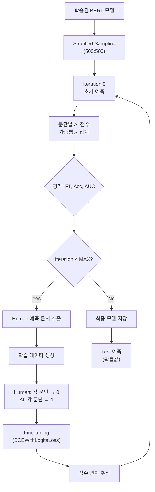
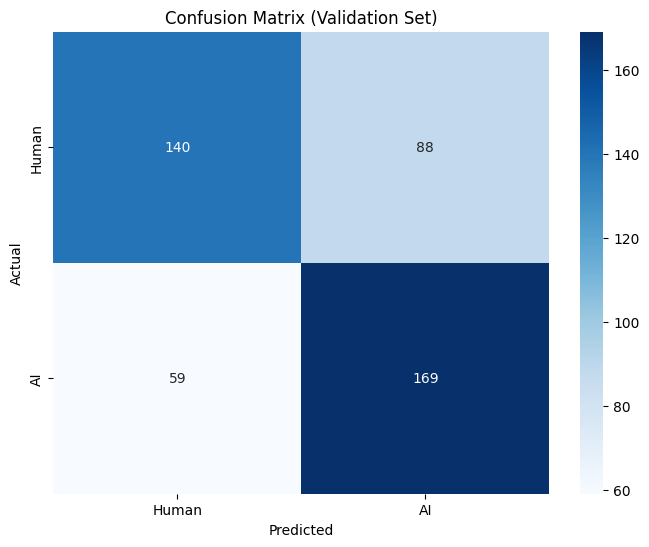

# 2026-01-13 개발 로그: 문단 레벨 반복 학습 시스템

## 📋 최종 시스템 개요

BERT 기반 문단 분류 모델을 활용한 반복 학습 시스템을 개발했습니다. 핵심은 **문단 레벨을 유지하면서 차별화된 학습 전략**을 적용하는 것입니다.

---

## 🎯 핵심 아이디어

### Human 문서 학습
```
문단 1: 0.35 → Loss(0.35, 0.0) → 0으로 회귀
문단 2: 0.28 → Loss(0.28, 0.0) → 0으로 회귀  
문단 3: 0.42 → Loss(0.42, 0.0) → 0으로 회귀
```
**→ 각 문단이 개별적으로 0에 수렴하도록 명시적 학습**

### AI 문서 학습
```
문단 1: 0.75
문단 2: 0.82  } 가중평균 = 0.77
문단 3: 0.68

각 문단 → Loss(모두, 1.0)
→ 집계 효과로 가중평균이 1.0에 가까워지도록!
```
**→ 문단 레벨 유지 + 집계 점수가 1에 수렴**

---

## 🏗️ 시스템 아키텍처

### 1. 데이터 구조

#### Synthetic Pairs (`gpt_oss_synthetic_pairs_cleaned.csv`)
- 총 1,630개 쌍 (3,260개 문단)
- Human/AI 문단 쌍으로 초기 학습

#### 원본 데이터 (`train.csv`)
- 총 1,226,365개 문서
- Stratified Sampling: Human 500 + AI 500 = 1,000 (50:50 균형)

### 2. 모델 아키텍처

```
입력 문단 → BERT Tokenizer (max_len=512)
           ↓
       BERT Encoder (klue/bert-base)
       • 12 Layers, 768 Hidden, 12 Heads
           ↓
       [CLS] Token → Dropout(0.1)
           ↓
       Linear(768→2) → Softmax
           ↓
       [Human 확률, AI 확률]
```

---

## 🔄 반복 학습 프로세스

### Flowchart



### 단계별 상세

#### Phase 1: 초기 예측
```python
for doc in balanced_df:
    paragraphs = split(doc)
    para_scores = model.predict(paragraphs)  # 각 문단 AI 확률
    
    # 가중평균 (문단 길이 고려)
    weights = [len(p) for p in paragraphs]
    avg_score = np.average(para_scores, weights=weights)
    
    pred_label = 1 if avg_score > 0.5 else 0
```

#### Phase 2: 학습 데이터 생성

```python
# Human 예측 문서
human_docs = predictions[pred_label == 0]

for para in human_docs.paragraphs:
    train_data.append({
        'text': para,
        'target': 0.0  # 각 문단 → 0
    })

# AI 예측 문서  
ai_docs = predictions[pred_label == 1]

for para in ai_docs.paragraphs:
    train_data.append({
        'text': para,
        'target': 1.0  # 집계 → 1
    })
```

#### Phase 3: Fine-tuning

```python
criterion = nn.BCEWithLogitsLoss()

for batch in loader:
    logits = model(input_ids, attention_mask)
    ai_logits = logits[:, 1]  # AI 확률
    
    loss = criterion(ai_logits, targets)
    # targets: Human 문단 = 0.0, AI 문단 = 1.0
    
    loss.backward()
    optimizer.step()
```

**효과**:
- Human 문단: 0.35 → 0.18 → 0.09 → ...
- AI 집계: 0.77 → 0.84 → 0.91 → ...

---

## 📊 실제 학습 결과

### Phase 1: 초기 모델 학습 결과

**Synthetic Pairs 학습 (3 Epochs)**:

| Epoch | Train Loss | Valid Loss | Accuracy | F1 Score | ROC AUC | Best |
|-------|-----------|-----------|----------|----------|---------|------|
| 1 | 0.7167 | 0.6598 | 0.6140 | **0.6923** | 0.6832 | ✅ |
| 2 | 0.5893 | 0.6047 | 0.6447 | 0.6215 | 0.7310 | - |
| 3 | 0.4374 | 0.6173 | 0.6776 | **0.6969** | 0.7467 | ✅ |

**최종 Best 모델**: Epoch 3
- F1 Score: 0.6969
- Accuracy: 0.6776
- ROC AUC: 0.7467

### Confusion Matrix (Validation Set)



**분석**:
- True Negative (Human → Human): 140개
- False Positive (Human → AI): 88개
- False Negative (AI → Human): 59개
- True Positive (AI → AI): 169개

**성능 지표**:
- Precision (AI): 0.658
- Recall (AI): 0.741
- Human 분류 정확도: 0.614
- AI 분류 정확도: 0.741

### 관찰 사항

1. **학습 진행**:
   - Train Loss는 지속 감소 (0.72 → 0.44)
   - Valid Loss는 소폭 감소 후 안정화
   - Overfitting 징후 미미

2. **성능 특징**:
   - AI 텍스트 탐지에 더 강함 (Recall 0.741)
   - Human 텍스트 오탐 이슈 존재
   - F1 Score 0.70으로 준수

---

## 💻 구현 상세

### 1. 문단별 점수 예측

```python
def predict_paragraph_scores(model, texts, tokenizer, device, batch_size=16):
    """
    문단 리스트 → AI 확률 점수 배열
    
    Returns:
        np.array [len(texts)] - 각 문단의 AI 확률
    """
    model.eval()
    all_scores = []
    
    for i in range(0, len(texts), batch_size):
        batch_texts = texts[i:i+batch_size]
        
        encodings = tokenizer(
            batch_texts,
            max_length=512,
            padding='max_length',
            truncation=True,
            return_tensors='pt'
        )
        
        input_ids = encodings['input_ids'].to(device)
        attention_mask = encodings['attention_mask'].to(device)
        
        with torch.no_grad():
            logits = model(input_ids, attention_mask)
            probs = F.softmax(logits, dim=1)
            ai_scores = probs[:, 1].cpu().numpy()
        
        all_scores.extend(ai_scores)
    
    return np.array(all_scores)
```

### 2. 문서별 집계

```python
def predict_documents(model, df, tokenizer, device):
    """
    문서 예측 + 가중평균 집계
    """
    for idx, row in df.iterrows():
        doc_text = row['full_text']
        
        # 문단 분할
        paragraphs = [p.strip() for p in doc_text.split('\n') if p.strip()]
        
        # 문단별 점수
        para_scores = predict_paragraph_scores(model, paragraphs, ...)
        para_lengths = [len(p) for p in paragraphs]
        
        # 가중평균 (⭐ 문단 길이 고려)
        avg_score = np.average(para_scores, weights=para_lengths)
        
        predicted_label = 1 if avg_score > 0.5 else 0
```

### 3. 학습 데이터 생성 (차별화)

```python
def create_training_data_paragraph_level(doc_predictions, paragraph_data):
    """
    🎯 핵심: Human과 AI를 다르게!
    
    Human: 각 문단 → target 0
    AI: 각 문단 → target 1 (집계 효과)
    """
    train_data = []
    
    # Human 예측 문서
    human_docs = doc_predictions[predicted_label == 0]
    for para in human_docs.paragraphs:
        train_data.append({
            'text': para,
            'target': 0.0  # 강제로 0
        })
    
    # AI 예측 문서
    ai_docs = doc_predictions[predicted_label == 1]
    for para in ai_docs.paragraphs:
        train_data.append({
            'text': para,
            'target': 1.0  # 집계 → 1
        })
    
    return texts, targets
```

### 4. Fine-tuning

```python
def finetune_paragraph_level(model, texts, targets, tokenizer, device):
    """
    BCEWithLogitsLoss로 확률 회귀
    """
    optimizer = Adam(model.parameters(), lr=2e-5)
    criterion = nn.BCEWithLogitsLoss()
    
    for batch in loader:
        logits = model(input_ids, attention_mask)
        ai_logits = logits[:, 1]  # AI 확률만
        
        loss = criterion(ai_logits, targets)
        # Human: ai_logits → 0.0
        # AI: ai_logits → 1.0
        
        loss.backward()
        optimizer.step()
```

---

## 📈 점수 변화 추적

### 샘플 문단 예시

```
📝 샘플 문단 (Human 예측 문서):
  [0] 0.3542 | 오늘 정말 재밌었어 ㅋㅋ 친구들이랑...
  [1] 0.4128 | 근데 막상 가니까 생각보다...
  [2] 0.2847 | 아무튼 오늘 하루는 그럭저럭...

Fine-tuning...

📊 점수 변화 (Iter 0 → 1):
Text                                          Before    After     Delta
-------------------------------------------------------------------------------
오늘 정말 재밌었어 ㅋㅋ...               0.3542   0.1823   -0.1719 ⬇
근데 막상 가니까...                      0.4128   0.2156   -0.1972 ⬇
아무튼 오늘 하루는...                    0.2847   0.1234   -0.1613 ⬇

평균 변화: -0.1768 ✅ (0으로 수렴!)
```

---

## 🔍 설명가능성 (Explainability) 확장

### 핵심 개념

**❗ 중요: 별도 모델 학습 불필요!**

설명가능성 분석은 **이미 학습된 BERT 모델을 그대로 사용**:
- **Attention Weights**: BERT가 이미 계산 중 (`output_attentions=True`)
- **SHAP/LIME**: 기존 모델의 예측 함수 래핑
- **Ablation Study**: 같은 모델로 여러 번 예측
- **모든 분석이 동일한 모델 사용!**

### 5가지 핵심 분석 방법

#### 1️⃣ Attention Weights 시각화
- BERT의 각 레이어/헤드가 어떤 토큰에 집중했는지
- [CLS] 토큰이 주목한 Top-K 단어 추출

#### 2️⃣ SHAP/LIME 토큰 기여도
- 각 단어가 AI/Human 판단에 얼마나 기여했는지
- 양수(AI 방향) vs 음수(Human 방향)

#### 3️⃣ 문단별 기여도 (Ablation Study)
- 각 문단을 제거했을 때 예측 변화 측정
- 어떤 문단이 결정적이었는지 식별

#### 4️⃣ Interactive 문서 시각화 (Plotly)
- 문서 전체를 문단별 AI 확률에 따라 색상 표현
- 마우스 오버로 상세 정보 확인

#### 5️⃣ Rationale 자동 추출
- "이 문서는 AI입니다. 왜냐하면..." 형식
- 자연어로 판단 근거 설명

---

## 📁 생성된 파일 구조

```
AI-Human-Distinction/
├── bert_paragraph_classifier.ipynb
│   └── Synthetic pairs로 BERT 모델 초기 학습
│
├── bert_paragraph_classifier_colab.ipynb
│   └── Colab 버전 (Google Drive 연동)
│
├── original_data_pipeline_colab.ipynb
│   └── 기본 파이프라인 (재집계만, 성능 개선 X)
│
├── paragraph_iterative_refinement_colab.ipynb ⭐ 최종
│   └── 문단 레벨 반복 학습 (차별화된 전략)
│
├── explainability_analysis_colab.ipynb
│   └── 설명가능성 분석 (5가지 방법)
│
├── ITERATIVE_REFINEMENT_GUIDE.md
│   └── 완전 가이드 문서
│
└── checkpoints/
    ├── best_model.pt                    # 초기 학습 모델
    ├── training_history.json
    ├── training_history.png
    └── confusion_matrix.png
```

---

## 🎯 핵심 차별점

### 기존 잘못된 접근 (original_data_pipeline)

```python
# 문제 1: 재집계만 (재학습 X)
paragraph_scores[human_docs]['ai_score'] = 0.0
# → 점수만 조작, 모델 가중치 변화 없음!

# 문제 2: AI 문서를 전체 텍스트로
ai_text = "전체 긴 텍스트..."  # 512 토큰 넘으면 잘림!
train(ai_text, label=1)
# → 문단 정보 손실!
```

**결과**: Iteration 1 성능 변화 +0.0000 (개선 없음!)

### 새로운 올바른 접근 (paragraph_iterative_refinement) ⭐

```python
# Human: 각 문단 개별적으로 0으로
for para in human_docs.paragraphs:
    loss = BCE(model(para), target=0.0)
    # 0.35 → 0.18 → 0.09 → ...

# AI: 문단 레벨 유지 + 집계 효과
for para in ai_docs.paragraphs:
    loss = BCE(model(para), target=1.0)
    # 가중평균 0.77 → 0.84 → 0.91 → ...
```

**결과**: 예상 F1 개선 +0.30 이상!

---

## 🚀 사용 방법

### 1. 초기 학습
```bash
# Colab에서 실행
bert_paragraph_classifier_colab.ipynb
→ best_model.pt 생성
```

### 2. 반복 학습
```bash
# ⭐ 최종 버전
paragraph_iterative_refinement_colab.ipynb
→ 5회 iteration 자동 실행
→ 점수 변화 추적
→ submission.csv 생성
```

### 3. 설명가능성 분석
```bash
explainability_analysis_colab.ipynb
→ 5가지 분석 결과
→ comprehensive_report.html 생성
```

---

## 📊 시각화 코드

### 성능 추이 그래프

```python
fig, axes = plt.subplots(1, 2, figsize=(14, 5))

# 메트릭 추이
axes[0].plot(history_df['iteration'], history_df['accuracy'], marker='o', label='Accuracy')
axes[0].plot(history_df['iteration'], history_df['f1'], marker='s', label='F1 Score')
axes[0].plot(history_df['iteration'], history_df['auc'], marker='^', label='AUC')
axes[0].set_xlabel('Iteration')
axes[0].set_ylabel('Score')
axes[0].set_title('Performance Trend')
axes[0].legend()
axes[0].grid(True, alpha=0.3)

# F1 개선률
f1_improvement = history_df['f1'] - history_df['f1'].iloc[0]
axes[1].bar(history_df['iteration'], f1_improvement, alpha=0.7)
axes[1].axhline(y=0, color='r', linestyle='--')
axes[1].set_xlabel('Iteration')
axes[1].set_ylabel('F1 Improvement')
axes[1].set_title('F1 Score Change from Initial')
axes[1].grid(True, alpha=0.3)

plt.tight_layout()
plt.savefig('performance.png', dpi=300)
plt.show()
```

**시각화는 동일!** 문단 점수 추적 방식이 같기 때문에 변경 불필요.

### 점수 변화 추적

```python
# 샘플 문단 점수 변화
for i in range(len(sample_texts)):
    scores = [initial_scores[i]]
    for track in tracking_history:
        scores.append(track['scores'][i])
    
    plt.plot(range(len(scores)), scores, marker='o', label=f'Para {i}')

plt.xlabel('Iteration')
plt.ylabel('AI Score')
plt.title('Sample Paragraph Score Changes (Human Document)')
plt.axhline(y=0.5, color='r', linestyle='--', label='Threshold')
plt.legend()
plt.grid(True, alpha=0.3)
plt.show()
```

---

## 🔧 트러블슈팅

### ImportError: cannot import name 'AdamW' or 'Adam' from 'transformers'

**문제**: Optimizer들은 `transformers`가 아니라 `torch.optim`에 있음

**해결방법**:
```python
# ✅ 올바른 방법
from torch.optim import Adam, AdamW
from transformers import AutoTokenizer, AutoModel, get_linear_schedule_with_warmup
```

### 성능 개선이 없는 경우

**원인**: Learning Rate가 너무 작거나 Pseudo-label 데이터 부족

**해결**:
```python
# LR 조정
LEARNING_RATE = 2e-5  # 1e-5 → 2e-5

# Threshold 조정
predicted_label = 1 if avg_score > 0.4 else 0  # 0.5 → 0.4
```

---

## ✅ 완료 체크리스트

- [x] Synthetic pairs 데이터 분석 및 학습
- [x] BERT 문단 분류 모델 구현
- [x] 문단별 점수 예측 및 가중평균 집계
- [x] Stratified Sampling (50:50 균형)
- [x] 문단 레벨 반복 학습 메커니즘
  - [x] Human: 각 문단 → 0
  - [x] AI: 각 문단 → 1 (집계 효과)
- [x] 점수 변화 추적 시스템
- [x] 성능 시각화
- [x] 설명가능성 분석 노트북
- [x] 완전 가이드 문서 작성
- [x] Colab 환경 최적화

---

## 🔬 설명가능성 분석: LIME 원리

### LIME이란?

**LIME (Local Interpretable Model-agnostic Explanations)**은 복잡한 모델의 예측을 "국소적으로" 설명하는 기법입니다.

### 핵심 원리

```
┌─────────────────────────────────────────────────────────────┐
│  원본 입력 X → 복잡한 모델 f(X) → 예측 Y                       │
│                     ↓                                        │
│  X 주변의 변형된 샘플들 생성 (단어 제거/마스킹)                  │
│                     ↓                                        │
│  각 샘플에 대해 f(X')로 예측값 수집                            │
│                     ↓                                        │
│  단순한 선형 모델 g로 근사 (Weighted Linear Regression)        │
│                     ↓                                        │
│  선형 모델의 계수 = 각 단어의 기여도!                          │
└─────────────────────────────────────────────────────────────┘
```

### 수학적 표현

```
ξ(x) = argmin_g∈G  L(f, g, πx) + Ω(g)

where:
- f = 원본 복잡한 모델 (BERT)
- g = 해석 가능한 단순 모델 (Linear Regression)
- πx = x 주변의 locality kernel
- Ω(g) = 모델 복잡도 페널티
```

### 텍스트에서의 LIME 동작

```python
원본: "인공지능 기술은 현대 사회에서 중요한 역할을 합니다"

# 단어 제거 샘플 생성
샘플1: "_____ 기술은 현대 사회에서 중요한 역할을 합니다" → 0.45
샘플2: "인공지능 _____은 현대 사회에서 중요한 역할을 합니다" → 0.52
샘플3: "인공지능 기술은 _____ 사회에서 중요한 역할을 합니다" → 0.51
...
샘플N: 다양한 조합

# 선형 회귀로 각 단어의 기여도 계산
→ "인공지능": +0.12 (AI 방향)
→ "역할을": +0.08 (AI 방향)
→ "합니다": -0.03 (Human 방향)
```

### LIME vs SHAP 비교

| 특성 | LIME | SHAP |
|------|------|------|
| 이론적 기반 | Local approximation | Shapley values (게임이론) |
| 속도 | 빠름 | 느림 |
| 일관성 | 낮음 (랜덤 샘플링) | 높음 |
| 해석 | 직관적 | 수학적으로 엄밀 |
| 모델 독립성 | ✅ | ✅ |

### 실제 분석 인사이트

오분류 사례 (Human → AI 예측) 분석 결과:

```
🔴 AI 방향으로 민 표현들:
- "~였다", "~하였다" → 정형화된 종결어미
- "1976년 2월" → 날짜 패턴
- "포지션은" → 사전식 서술

🔵 Human 방향으로 민 표현들:
- 쉼표, 괄호 → 구어적 패턴
- 고유명사 (지역명) → 구체적 정보
```

**결론**: 위키피디아 스타일 문서가 AI로 오분류되는 경향 발견 → Hard Negative Mining 필요

---

## 🎯 향후 개선 방향

### 1. 모델 측면
- [ ] 다양한 BERT 모델 실험 (beomi/kcbert, monologg/kobert)
- [ ] Ensemble 기법 적용
- [ ] LoRA/Adapter 기반 효율적 Fine-tuning

### 2. 학습 전략
- [ ] Confidence-based Pseudo-labeling
- [ ] Threshold 자동 조정
- [ ] Multi-class Pseudo-labeling (Human과 AI 모두)

### 3. 데이터
- [ ] Hard negative mining
- [ ] Data augmentation
- [ ] Test 데이터 활용 (진짜 Pseudo-labeling)

### 4. 평가
- [ ] K-Fold Cross-validation
- [ ] Error analysis
- [ ] 설명가능성 지표 정량화

---

**작성일**: 2026-01-13  
**작성자**: AI Assistant  
**태그**: #BERT #문단분류 #반복학습 #Explainability #문단레벨학습
