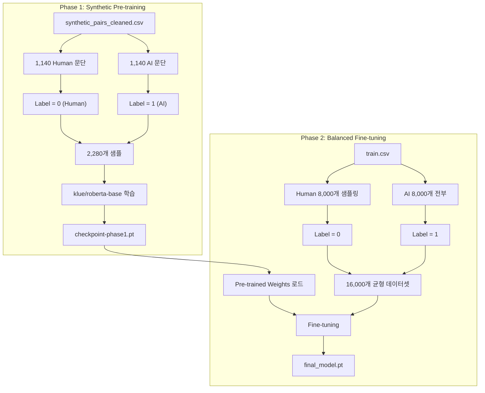

# 🛠️ Dev Log & Idea Sketch (2026-01-12)

> **마지막 업데이트**: 2026-01-12 18:06

---

## 📋 목차
1. [모델링 전략 수립](#모델링-전략-수립)
2. [DeepSeek-R1 방법론 적용](#deepseek-r1-방법론-적용)
3. [Feature Analysis 결과](#feature-analysis-결과)
4. [Lexical & Stylistic Analysis](#lexical--stylistic-analysis)
5. [BERT Baseline Pipeline](#bert-baseline-pipeline)
6. [토큰 길이 분석](#토큰-길이-분석)
7. [Synthetic Pair Dataset 파이프라인](#synthetic-pair-dataset-파이프라인)
8. [첫 번째 베이스라인 제출 결과](#첫-번째-베이스라인-제출-결과)
9. [학습 전략 비교 및 결정](#학습-전략-비교-및-결정)
10. [방법론 정당화 (Mentor 발표용)](#방법론-정당화)
11. [Ablation Study 계획](#ablation-study-계획)

---

## 모델링 전략 수립

### 🎯 핵심 문제 정의 (Problem Definition)

| 문제 | 설명 |
|------|------|
| **Label Granularity Mismatch** | Train은 Full Text 단위, Test는 Paragraph 단위 |
| **Label Noise** | `generated=1`에도 Human 문단이 섞여있음 |
| **클래스 불균형** | AI 8% vs Human 92% |

### 💡 접근 전략: Synthetic Data & 2-Stage Modeling

**가설**: Human 데이터(`generated=0`)의 문단은 100% 신뢰 가능한 "Source"

**생성 전략**:
1. **Re-writing**: "이 문단을 AI 스타일로 다시 써줘."
2. **결과**: (Human Para, 0) vs (Generated AI Para, 1) 쌍 데이터셋 확보

---

## DeepSeek-R1 방법론 적용

| DeepSeek-R1 단계 | 우리 적용 |
|---|---|
| **Cold Start (SFT)** | Human 문단으로 Synthetic AI 문단 생성 |
| **Rejection Sampling** | 생성된 AI 문단 중 품질 좋은 것만 필터링 |
| **Distillation** | LLM(Teacher)이 생성한 데이터로 BERT(Student) 학습 |

```
[Phase 1: Data Generation]
Human 문단 → LLM (Generator) → AI 스타일 문단 생성 → Synthetic Dataset

[Phase 2: Model Training]
BERT/RoBERTa (Discriminator) 학습 → Self-Training / Refinement
```

---

## Feature Analysis 결과

KoGPT2를 이용한 Human(100개) vs AI(100개) 분석

| Feature | AI | Human | 해석 |
|---------|-----|-------|------|
| **Perplexity** | 95.6 | 126.9 | AI가 더 예측 가능 |
| **Logprob Std** | 3.03 | 3.34 | AI가 더 일관적 |
| **Bigram Rep** | 0.023 | 0.030 | 사람이 반복 더 많음 |

**Rule-based Filter**: `Perplexity < 110` → AI 가능성 높음

---

## Lexical & Stylistic Analysis

| Feature | AI | Human | 해석 |
|---------|-----|-------|------|
| **Formal Endings (-다/-니다)** | 0.298 | 0.007 | AI가 격식체 선호 |
| **Conjunction Density** | 0.93% | 0.68% | AI가 접속사 더 사용 |
| **Tilde (~)** | 낮음 | 높음 | 사람이 감정 표현 |

**Strong Rule**: `Formal End Ratio > 0.1` → AI일 확률 급상승

---

## BERT Baseline Pipeline

- **Notebook**: `modeling/bert_baseline.ipynb`
- **Model**: `klue/roberta-base`
- **Input Shape**: `[Batch, 512]`
- **Output Logits**: `[Batch, 2]`

---

## 토큰 길이 분석

| MAX_LEN | Truncation Rate |
|---------|-----------------|
| 512 | **71.25%** |
| 1024 | 31.32% |

**문제**: 71% 데이터가 잘림 → **Paragraph Splitting** 전략 채택

---

## Synthetic Pair Dataset 파이프라인

### 구현 상세

| 단계 | 설명 | 결과 |
|------|------|------|
| 1. 문단 분리 | Human 글 → `\n` 기준 분리 | 1,125,652개 |
| 2. 샘플링 | 100개 문서 선택 | 1,174개 문단 |
| 3. AI 생성 | Ollama Cloud (`gpt-oss:20b-cloud`) | 진행 중 |

**출력 파일**: `synthetic_pairs.csv`

---

## 첫 번째 베이스라인 제출 결과

| 항목 | 값 |
|------|-----|
| **점수** | 0.5127 ~ 0.5161 ROC-AUC |
| **의미** | ❌ 랜덤 수준 |
| **파일** | `submissions/baseline_v1.csv` |

### 실패 원인
1. Label Noise
2. 단위 불일치 (Full Text vs Paragraph)
3. 클래스 불균형

---

## 학습 전략 비교 및 결정

### ROC-AUC 최적화 Loss

| Loss | 추천 |
|------|------|
| CrossEntropy | 기본 |
| **Focal Loss** | ✅ 추천 |

```python
class FocalLoss(torch.nn.Module):
    def __init__(self, alpha=0.25, gamma=2.0):
        super().__init__()
        self.alpha = alpha
        self.gamma = gamma
    
    def forward(self, logits, targets):
        ce_loss = F.cross_entropy(logits, targets, reduction='none')
        pt = torch.exp(-ce_loss)
        focal_loss = self.alpha * (1 - pt) ** self.gamma * ce_loss
        return focal_loss.mean()
```

### ✅ 결정: 전략 B (페어 → 균형 원데이터)

```
[Phase 1] Synthetic Pair + Focal Loss
[Phase 2] 균형 원데이터 (Human 8k + AI 8k) Fine-tune
```

---

## 방법론 정당화

### Q1. 왜 Synthetic Pair 데이터?
- **Label Noise 제거** + **문단 단위 학습** 가능

### Q2. 왜 klue/roberta-base?
- 한국어 특화 + 분류 최적화 + 효율적

### Q3. 왜 Focal Loss?
- 불균형 해결 + AUC 향상

### Q4. 왜 2-Stage 학습?
- Clean → Noisy 순서가 안정적

---

## Ablation Study 계획

| 실험 ID | Phase 1 | Phase 2 | 가설 |
|---------|---------|---------|------|
| **Exp1** | Synthetic Pair | 균형 원데이터 | ✅ 최고 |
| **Exp2** | 균형 원데이터 | Synthetic Pair | 비교군 |
| **Exp3** | Synthetic Pair만 | - | 데이터 부족 |
| **Exp4** | 균형 원데이터만 | - | Baseline |

### 결과 기록
| 실험 | Train AUC | Val AUC | LB Score |
|------|-----------|---------|----------|
| Exp1 |           |         |          |
| Exp2 |           |         |          |
| Exp3 |           |         |          |
| Exp4 |           |         |          |

---

## 🎯 Training Plan: Strategy B



### 📌 핵심 포인트

| 항목 | Phase 1 (Pre-training) | Phase 2 (Fine-tuning) |
|------|------------------------|----------------------|
| **데이터** | Synthetic 1,140쌍 (2,280개) | 원본 균형 데이터 16,000개 |
| **목적** | 깨끗한 패턴 학습 | 실제 분포 적응 |
| **Epochs** | 3~5 | 2~3 |
| **LR** | 2e-5 | 1e-5 (더 낮게) |
| **Loss** | Focal Loss | Focal Loss |

### 🧩 코드 구조 (예정)

```python
# modeling/train.py

# --- Phase 1 ---
train_phase1(
    data='synthetic_pairs_cleaned.csv',
    model='klue/roberta-base',
    epochs=3,
    save_to='checkpoint-phase1.pt'
)

# --- Phase 2 ---
train_phase2(
    data='train.csv',  # 균형 샘플링
    model='checkpoint-phase1.pt',
    epochs=2,
    save_to='final_model.pt'
)
